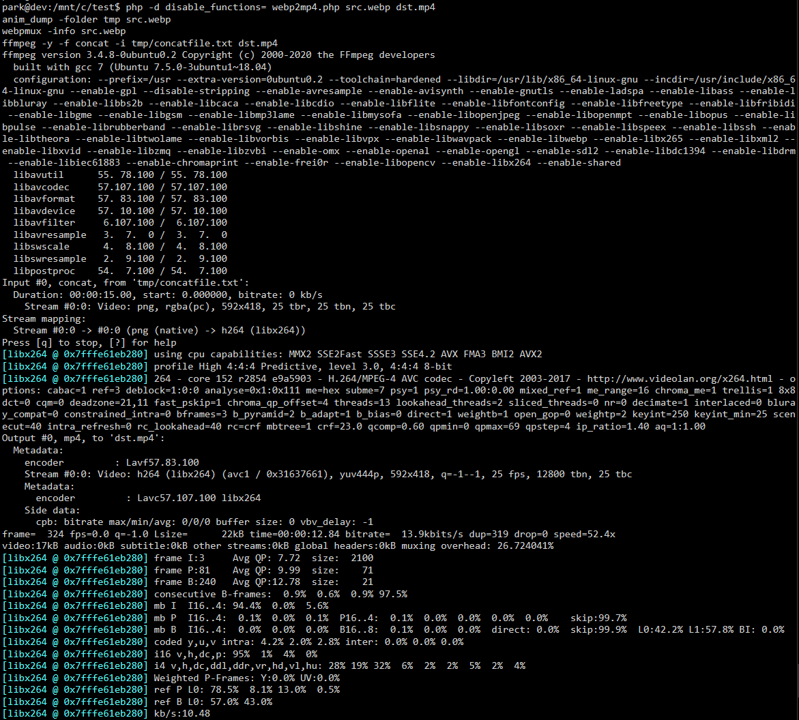

# webp2mp4

## ffmpeg 을 이용하여 animated webp 파일을 mp4 파일로 변환하는 php 소스.

#

ffmpeg 은 GIF 파일을 동영상 취급하여, 다음과 같이 간단한 커맨드로 GIF->MP4 변환이 가능한 반면

> ffmpeg -i src.gif  result.mp4

webp 파일은 아직 이미지 취급을 하기 때문에 이러한 명령으로는 동영상 파일로 변환이 불가능하다.

다음 과정을 따라서 WEBP -> MP4 변환이 가능하며, 이 문서와 소스는 다음 링크의 글을 참고하였다.

### webp -> png 변환
	https://askubuntu.com/questions/1140873/how-can-i-convert-an-animated-webp-to-a-webm

### png -> mp4 변환
	https://video.stackexchange.com/questions/24976/set-display-time-of-individual-frames-in-ffmpeg

#

## 1. webpmux 설치하기

Animated WebP 파일을 PNG 로 변환하기 위해서 webpmux 를 설치한다.

	git clone https://chromium.googlesource.com/webm/libwebp && cd libwebp
	echo "bin_PROGRAMS += anim_dump" >> examples/Makefile.am
	./autogen.sh && ./configure && make && sudo make install
	echo "/usr/local/lib" |sudo tee -a /etc/ld.so.conf&& sudo ldconfig

## 2. WebP -> 변환

다음 명령으로 dump_NNNN.png 파일이 생성된다.

	anim_dump ../test.webp

## 3. WebP 의 각 프레임 시간 알아내기

일반적인 동영상과 달리 WebP 나 GIF 파일은 영상 전체가 아닌, 프레임 별로 프레임의 시간(duration) 이 지정되어 있다. 따라서 다음과 같은 명령으로 동영상을 생성하면 프레임별 재생시간이 들쭉날쭉해지는 문제가 발생할 수 있다.

	ffmpeg -framerate <my-framerate> -i frames/dump_%04d.png example.webm ==> X 

이 문제를 해결하기 위해서는 WebpMux 를 이용해서 각 프레임별 시간을 알아내야 한다.

	$ webpmux -info ../src.webp

	Canvas size: 592 x 418
	Features present: animation EXIF metadata
	Background color : 0xFFFFFFFF  Loop Count : 0
	Number of frames: 5
	No.: width height alpha x_offset y_offset duration   dispose blend image_size  compression
	1:   592   418    no        0        0     1000 background    no       1224       lossy
	2:   592   418    no        0        0     2000 background    no       1904       lossy
	3:   592   418    no        0        0     3000 background    no       2380       lossy
	4:   592   418    no        0        0     4000 background    no       2392       lossy
	5:   592   418    no        0        0     5000 background    no       2968       lossy
	Size of the EXIF metadata: 97

## 4. concatfile.txt 만들기

생성된 png 파일과 프레임시간을 가지고 다음과 같은 포맷의 concatfile 을 만든다.
webpmux와 달리 concatfile 의 시간은 sec 단위이다.

	file dump_0000.png
	duration 1.000000
	file dump_0001.png
	duration 2.000000
	file dump_0002.png
	duration 3.000000
	file dump_0003.png
	duration 4.000000
	file dump_0004.png
	duration 5.000000

## 5. ffmpeg 으로 인코딩

생성된 png 파일을 concat 파일을 사용하여 인코딩을 한다.

	ffmpeg -f concat -i concatfile.txt -pix_fmt yuv420p output.mp4

# 

위의 작업을 자동화 시킨것이 여기 첨부된 webp2mp4.php 이며 콘솔에서 다음과 같은 방법으로 WebP 파일을 mp4 로 변환할 수 있다.

	php -d disable_functions= webp2mp4.php src.webp dst.mp4

# 
원본 WebP 파일

